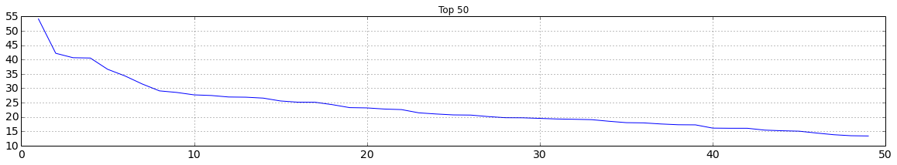
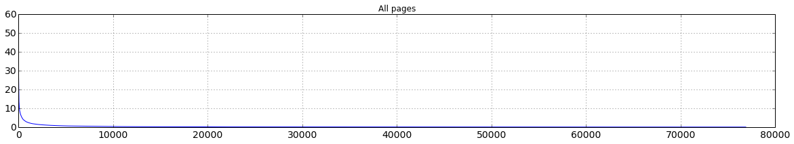
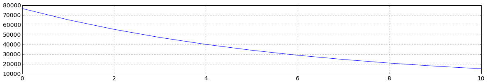

Cloud Programming Assingment 2 - PageRank
=============
作者: 顏孜羲

## Instruction
#### 編譯與包裝成 jar 檔
建立的 jar file 會在 target/scala-2.10/ 資料夾下。

    $ sbt assembly
    
#### 計算 Inverted Index

用法

    $ hadoop jar <the jar file> cc.nlplab.InvertedIndexMapReduce <input> <output>

範例

    $ hadoop jar target/scala-2.10/page-rank-assembly-0.1-cdh3.jar cc.nlplab.InvertedIndexMapReduce /opt/HW2/100M 100M-output-ii

#### 將 Inverted Index 寫入 HBase

用法

    $ hadoop jar <the jar file> cc.nlplab.InvertedIndexToHBase <output of prev step> <hbase table name>

範例

    $ hadoop jar target/scala-2.10/page-rank-assembly-0.1-cdh3.jar cc.nlplab.InvertedIndexToHBase 100M-output-ii 102062597_inverted_2
    
#### 計算 Page Rank

用法

    $ hadoop jar <the jar file> cc.nlplab.PageRankMapReduce <input> <output>

範例

    $ hadoop jar target/scala-2.10/page-rank-assembly-0.1-cdh3.jar cc.nlplab.PageRankMapReduce  /opt/HW2/100M 100M-output-pr
    
#### 將 Page Rank 寫入 HBase

用法

    $ hadoop jar <the jar file> cc.nlplab.PageRankWriteToHBase <output of prev step> <hbase table name>
    
範例

    $ hadoop jar target/scala-2.10/page-rank-assembly-0.1-cdh3.jar cc.nlplab.PageRankWriteToHBase 100M-output-final 102062597_pagerank_2
    
#### 搜尋

搜尋需提供 

1. PageRank 的 HBase table name
2. InvertedIndex 的 HBase table name
3. 來源的文件數量。  
   可由 cc.nlplab.InvertedIndexMapReduce 的 output 取得，用於計算 tf-idf。
4. 來源的文件，需放在 local disk，用於顯示來源句子。  
   由於 HDFS 不支援 Random Access，用 HDFS 顯示會非常慢，故改為使用 local 的文件。

用法

    $ hadoop jar <the jar file> cc.nlplab.Query <pagerank table> <inverted table> <doc_count> <input in local> <term>

範例

    $ hadoop jar target/scala-2.10/page-rank-assembly-0.1-cdh3.jar cc.nlplab.Query 102062597_pagerank_2 102062597_inverted_2 5194  ../input-100M programming
    
    
## Design

### 建立 Graph ###

#### 1. Mapper

##### 輸入: Offset => Document

    228 => <title>1</title> [[2]] [[4]] 
    445 => <title>2</title> [[1]] [[3]]
    667 => <title>4</title>

##### 輸出: "link " => title ; title => "" ; NULL => title
    
    "2 " => 1
    "4 " => 1
    1 => ""
    NULL => 1

    "1 " => 2
    "3 " => 2
    2 => ""
    NULL => 2

    4 => ""
    NULL => 4

    
#### 2. Partitioner

##### 輸入: link => title
    
##### 輸出: link.trim().hashCode() % numPartitions

將後綴的空白去除後再計算 hashCode。如此，有無空白做後綴的 link 都會送到同個 reducer。

#### 4. GroupComparator

##### 輸入: link1, link2

##### 輸出: link1.trim() compareTo link2.trim()

將後綴的空白去除後再相互 compare。如此，有無空白做後綴的 link 在 reducer 都會 group 在一起。

#### 5. Reducer

##### 輸入 link => title

    # Group 1
    1 => ""
      => 2

    # Group 2
    2 => ""
      => 1

    # Group 3, reject
    "3 " => 1
         => 2

    # Group 4
    4 => ""
      => 1

    # Group NULL
    NULL => 1
            2
            4

    
##### 輸出: title => link

由於有後綴空白的 link 會被 Sort 到較後面，於是可以從 key 是否有後綴空白來判斷這個 link 是否為 no out-link。O(1) 可完成。
NULL 的 link 會反向再輸出一次。

    # Group 1
    2 => 1

    # Group 2
    1 => 2

    # Group 3, reject

    # Group 4
    1 => 4
    
    # Group NULL
    1 => NULL
    2 => NULL
    4 => NULL
    NULL => 1
    NULL => 2
    NULL => 4

對照原始資料，可發現 1, 2, 4 都有 link 到 NULL，3 是 no-out link 被移除。其餘 title => link 也都已正確建立。

##### 原始資料

    <title>1</title> [[2]] [[4]] 
    <title>2</title> [[1]] [[3]]
    <title>4</title>

#### 6. Identity Mapper

##### 輸入: title => link

##### 輸出: title => link

    2 => 1
    1 => 2
    1 => 4
    1 => NULL
    2 => NULL
    4 => NULL
    NULL => 1
    NULL => 2
    NULL => 4

#### 7. Reducer

##### 輸入: title => link

    # Group 1
    1 => 2
      => 4
      => NULL

    # Group 2
    2 => 1
      => NULL

    # Group 4
    4 => NULL

    # Group NULL
    NULL => 1
            2
            4

##### 輸出: title => pr, links

最終得到的 Graph 如下。NULL 指到所有存在的 title, 每個 title 也都有個 link 指到 NULL。在機率上就表達著，不管現在在哪個 page，跳到 links 以外的任何 page 的機會是均等的。

    1 => 1.0, [2, 4, NULL]
    2 => 1.0, [1, NULL]
    4 => 1.0, [NULL]
    NULL => 1.0, [1, 2, 4]

### 計算 pageRank

pageRank 是 iteratively 方式執行的，每個 job 會串接起來，上次 job 的 output 為下次 job 的 input。終止條件靠 PR\_i - PR\_i-1 的平均值來判斷。PR\_i -PR\_i-1 的計算靠 Hadoop 的 Counter 完成，不需額外的 map reduce job。

#### 1. Mapper

##### 輸入: title => pr, links

    1 => pr1, [2, 4, NULL]
    2 => pr2, [1, NULL]
    4 => pr4, [NULL]
    NULL => prN, [1, 2, 4]

##### 輸出: title => 0, links ; link => pr/links.length, []

    1 => pr1, [2, 4, NULL]
    2 => pr1/3, []
    4 => pr1/3, []
    NULL => pr1/3, []

    2 => pr2, [1, NULL]
    1 => pr2/2, []
    NULL => pr2/2, []

    4 => pr4, [NULL]
    NULL => pr4/1, []

    NULL => prN, [1, 2, 4]
    1 => prN/3, []
    2 => prN/3, []
    4 => prN/3, []

#### 2. Reducer

##### 輸入: title => pr, links

    1 => pr1, [2, 4, NULL]
         pr2/2, []
         prN/3, []

    2 => pr1/3, []
         pr2, [1, NULL]
         prN/3, []

    4 => pr1/3, []
         pr4, [NULL]
         prN/3, []

    NULL => pr1/3, []
            pr2/2, []
            pr4/1, []
            prN, [1, 2, 4]

##### 輸出: title => pr, links

將 links 欄位無資料的 pr 加總，有資料為原始的 pr。將計算前後的 pr 相減，並加到 hadoop 的 counter，即可在 reduce 結束後直接得出 PR\_i - PR\_i-1 ，不需另外跑一次 map reduce。

透過 PR\_i - PR\_i-1 可判斷 page rank 的 iteration 是否要結束。目前是設定平均值 < 0.2 就結束 iteration。

    1 => pr2/2 + prN/3, [2, 4, NULL]

    2 => pr1/3 + prN/3, [1, NULL]

    4 => pr1/3 + prN/3, [NULL]

    NULL => pr/3 + pr2/2 + pr4/1, [1, 2, 4]

## Experiment

### 最終的 PageRank 計算結果
最終 PageRank 計算結果依照 PageRank 排序後呈現。第一張圖涵蓋前五十名的 PageRank，第二張圖為所有 Page 的 PageRank。

- 前五十名 PageRank

- 所有 Page 的 PageRank

### 每次 iteration 的 coverage Rate 

